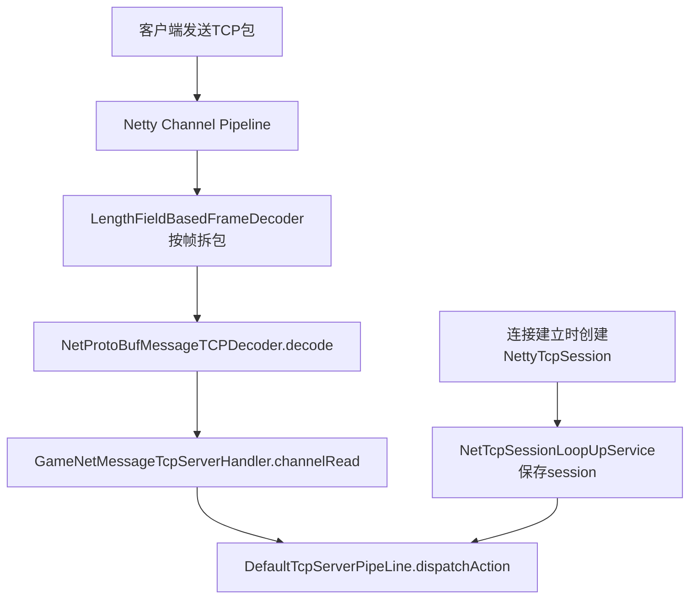
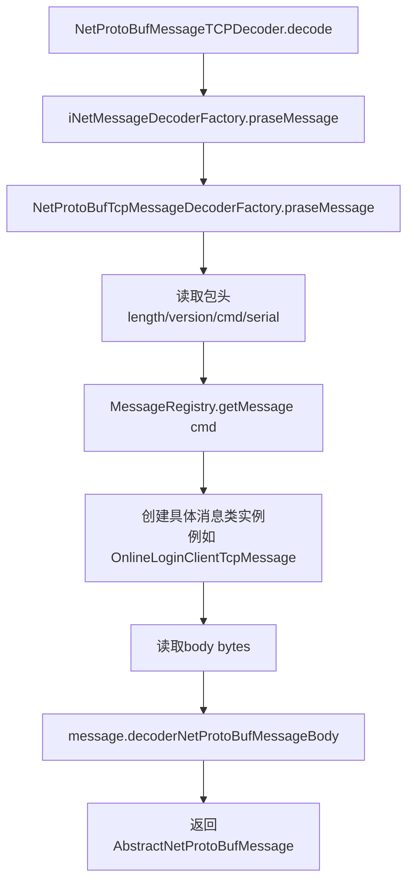
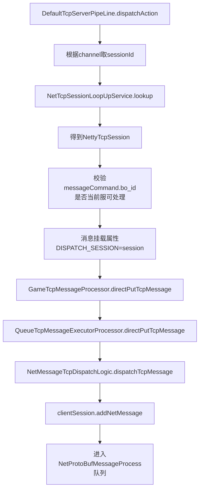
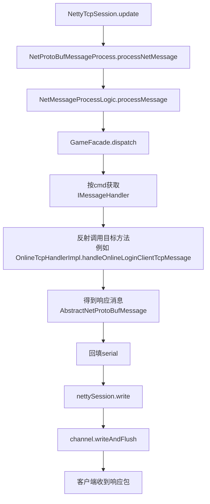
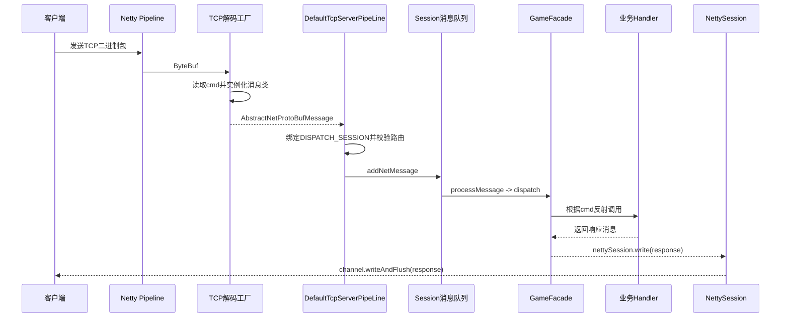

# NettyGameServer 消息流动详细流程图

## 文档目标
- 把 TCP 消息从“网络入站”到“业务处理并响应”的完整链路可视化。
- 按阶段拆图，降低复杂度，便于定位问题与学习源码。
- 每个阶段都标注关键类与核心方法。

## 总览分阶段
- 阶段A：连接建立与入站入口
- 阶段B：消息解码（ByteBuf -> 具体消息对象）
- 阶段C：消息分发（Pipeline -> Session 队列）
- 阶段D：消息处理与响应（Facade -> Handler -> writeAndFlush）

---

## 阶段A：连接建立与入站入口

### 关键点
- `GameNetMessageTcpServerHandler` 只做转发：把已解码消息交给 `DefaultTcpServerPipeLine`。
- `NettyTcpSession` 在连接建立时注册，后续分发阶段依赖它做会话绑定。

---

## 阶段B：消息解码（ByteBuf -> Message）

### 关键点
- `cmd` 是解码阶段最核心索引键。
- `MessageRegistry` 完成 `cmd -> 消息类` 的第一层映射。
- 每个消息类自行实现 protobuf 反序列化逻辑（`decoderNetProtoBufMessageBody`）。

---

## 阶段C：消息分发（Pipeline -> Session 队列）

### 关键点
- 这一阶段的本质是“绑定上下文 + 进入会话队列”。
- `DISPATCH_SESSION` 属性保证后续处理知道该写回哪个会话。

---

## 阶段D：消息处理与响应（Facade -> Handler -> writeAndFlush）

### 关键点
- `GameFacade` 完成第二层映射：`cmd -> handler method`。
- `serial` 回填用于请求-响应对齐。
- 最终统一由 `NettySession.write` 执行网络发送。

---

## 全链路时序图（精简版）

---

## 快速排障定位建议
- 解码异常：优先看 `NetProtoBufTcpMessageDecoderFactory.praseMessage` 的 `cmd` 与 body 解析。
- 分发不到 Handler：检查消息类与处理器方法的 `@MessageCommandAnnotation(command=...)` 是否一致。
- 有处理无回包：检查 `NetMessageProcessLogic` 中返回值是否为空、`NettySession.write` 是否抛异常。
- 回包错乱：检查 `serial` 回填与客户端关联逻辑。
