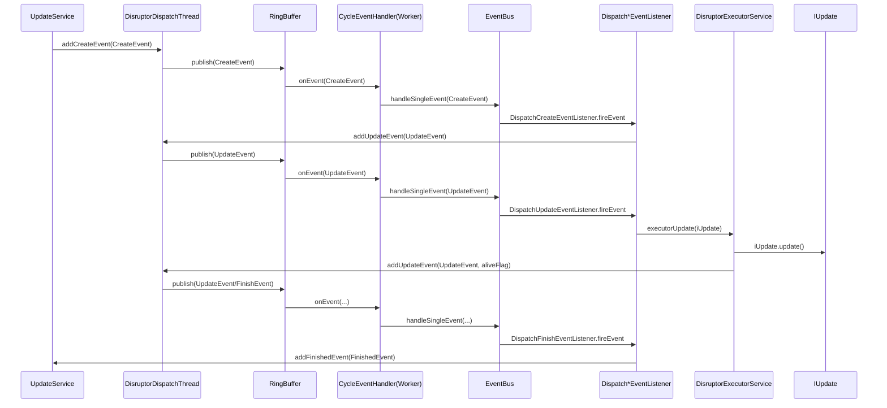
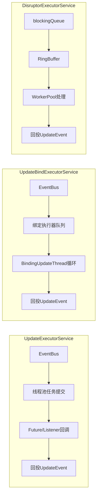
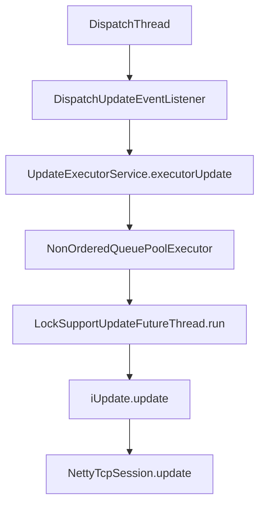
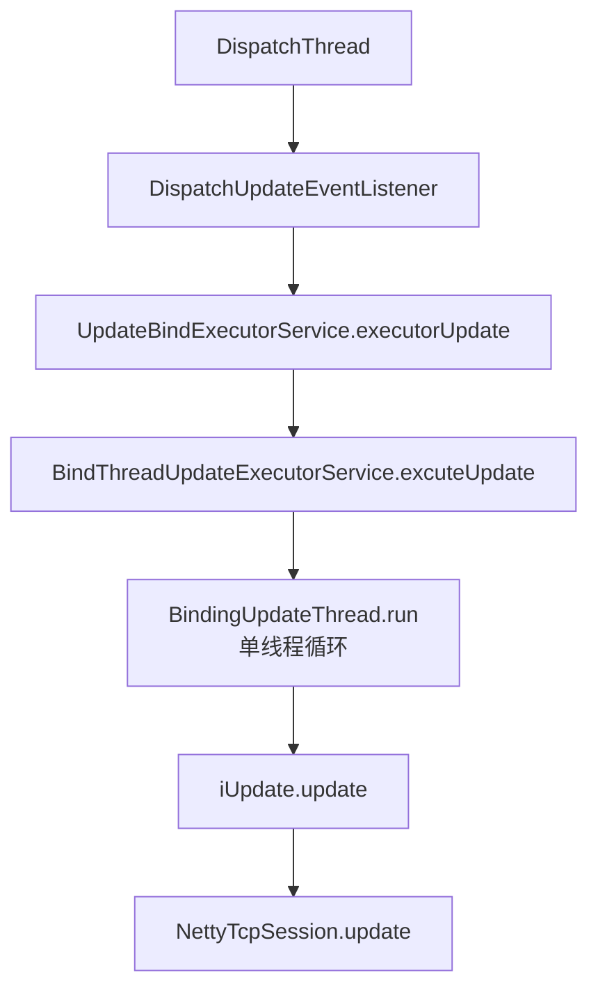
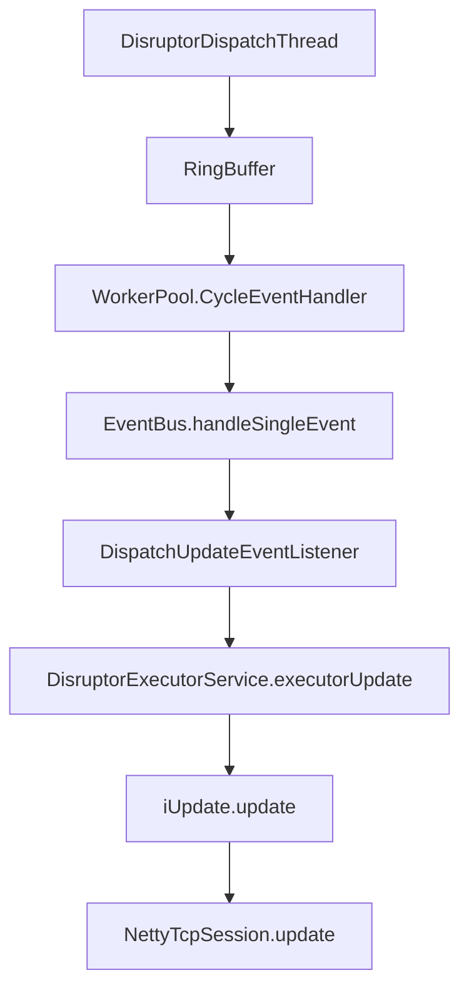
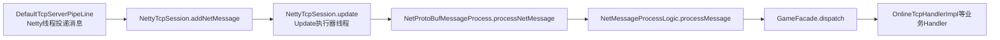
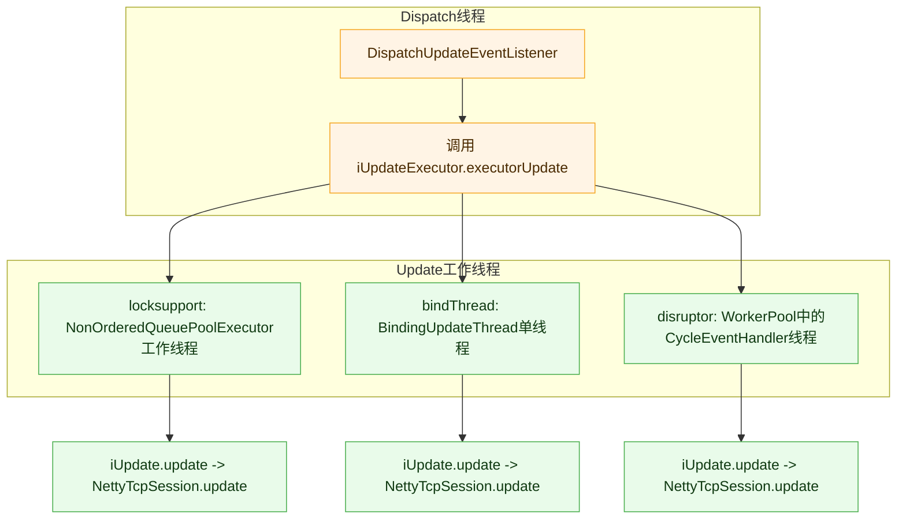
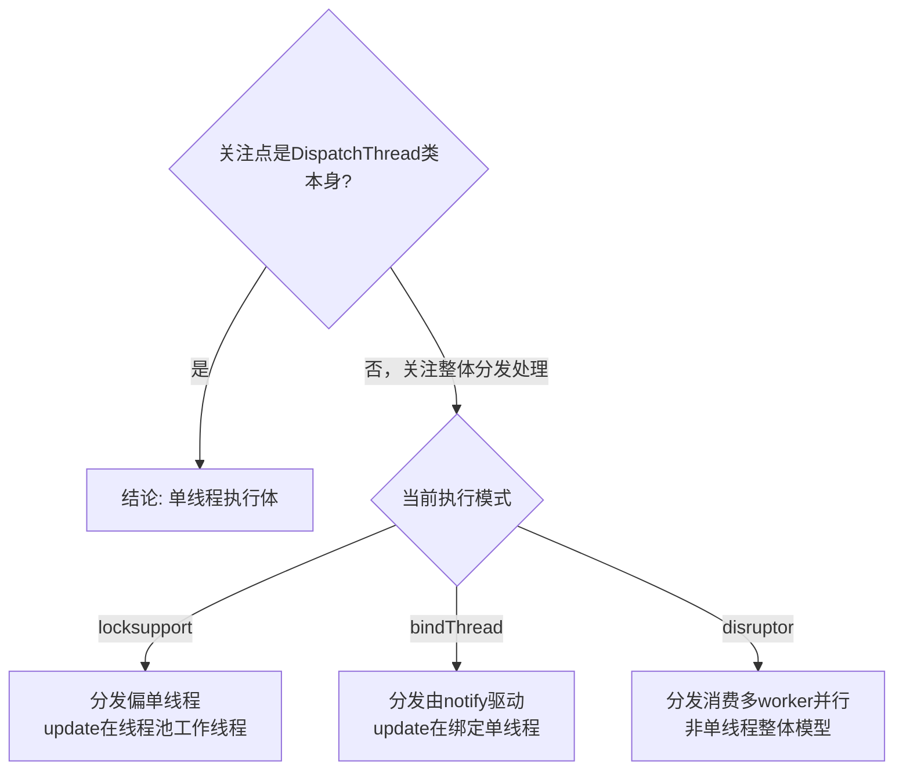

# NettyTcpSession.update 执行线程专项分析

## 你的核心问题
- `NettyTcpSession.update()` 到底在哪个线程执行？
- TCP 消息最终是否在 `UpdateExecutorService` / `UpdateBindExecutorService` / `DisruptorExecutorService` 这些执行器里执行？

## 结论先说
- **是的（针对 TCP 链路）**：`NettyTcpSession.update()` 不是在 Netty IO 线程执行，而是由 `UpdateService` 体系调度到 update 执行器线程执行。
- TCP 消息的业务处理（`GameFacade.dispatch -> Handler`）发生在 `NettyTcpSession.update()` 内部，所以**最终也在 update 执行器线程中执行**。
- Netty IO 线程主要负责：收包、解码、把消息放进 `NettyTcpSession` 队列，不直接执行业务处理主逻辑。

---

## 一、从连接建立到 update 对象注册

### 1) 会话注册时创建 update 对象
- `AbstractGameNetMessageTcpServerHandler.channelRegistered(...)` 中调用 `addUpdateSession(nettyTcpSession)`。
- `GameNetMessageTcpServerHandler.addUpdateSession(...)` 创建 `NettyTcpSerssionUpdate`，封装到 `CycleEvent`，调用 `updateService.addReadyCreateEvent(...)`。

### 2) `NettyTcpSerssionUpdate` 的核心
- `NettyTcpSerssionUpdate.update()` 直接调用 `nettyTcpSession.update()`。
- 所以只要 `IUpdate.update()` 在某线程执行，`NettyTcpSession.update()` 就在该线程执行。

---

## 二、谁触发执行：Dispatch + EventBus + Listener

### 1) UpdateService 启动
- `GlobalManager.initUpdateService()` 根据配置 `updateServiceExcutorFlag` 构造不同执行器与 `DispatchThread`。
- `UpdateService.start()` 会启动：
  - `dispatchThread.start()`
  - `iUpdateExecutor.startup()`

### 2) 事件流
- `UpdateService.addReadyCreateEvent(...)` -> 放入 `CreateEvent` 到 `dispatchThread` 的 `EventBus`。
- `DispatchCreateEventListener` 收到 create 后，投递 `UpdateEvent`。
- `DispatchUpdateEventListener` 收到 update 后调用：
  - `iUpdateExecutor.executorUpdate(dispatchThread, iUpdate, ...)`

因此，真正执行 `iUpdate.update()` 的位置由具体 `IUpdateExecutor` 决定。

### 3) 总体调度流程图（线程视角）

```mermaid
flowchart LR
    A[Netty IO线程\nchannelRegistered] --> B[GameNetMessageTcpServerHandler.addUpdateSession]
    B --> C[UpdateService.addReadyCreateEvent]
    C --> D[DispatchThread EventBus\nCreateEvent->UpdateEvent]
    D --> E[DispatchUpdateEventListener]
    E --> F[iUpdateExecutor.executorUpdate]
    F --> G[IUpdate.update\n即 NettyTcpSerssionUpdate.update]
    G --> H[NettyTcpSession.update]
    H --> I[NetProtoBufMessageProcess.processNetMessage]
    I --> J[NetMessageProcessLogic.processMessage]
    J --> K[GameFacade.dispatch -> Handler]
```

---

## 三、三种执行器的线程归属差异

### Disruptor 模式下 `EventBus` 如何运作（详细版）

#### 1) 先看参与者（你会看到 4 个核心组件）
- `UpdateService`：业务入口，负责把 `IUpdate` 包装成事件并投递。
- `DisruptorDispatchThread`：桥接线程，把内部 `blockingQueue` 里的事件转发到 `RingBuffer`。
- `DisruptorExecutorService`：启动 `WorkerPool`，把 `CycleEventHandler` 绑定到 ringBuffer 消费。
- `EventBus`：真正的“事件分派器”，按 `eventType -> listenerSet` 调用监听器。

#### 2) 关键点：Disruptor 模式不是“绕过 EventBus”
- Disruptor 只负责高效搬运/并发消费事件。
- 事件真正被解释与执行，仍通过 `EventBus.handleSingleEvent(...)` 完成。
- 也就是说：**Disruptor 是传输层，EventBus 是分派层**。

#### 3) 事件生命周期（以单个 `IUpdate` 为例）
1. `GameNetMessageTcpServerHandler.addUpdateSession(...)` 调 `updateService.addReadyCreateEvent(...)`。
2. `UpdateService` 把 `CreateEvent` 放进 `dispatchThread`（DisruptorDispatchThread）的队列。
3. `DisruptorDispatchThread.run()` 取事件，写入 ringBuffer 并 `publish`。
4. `WorkerPool` 的 `CycleEventHandler.onEvent(...)` 收到事件后，调用 `eventBus.handleSingleEvent(event)`。
5. `EventBus` 根据类型命中监听器：
   - `CreateEvent` -> `DispatchCreateEventListener`，生成并投递 `UpdateEvent`。
   - `UpdateEvent` -> `DispatchUpdateEventListener`，调用 `iUpdateExecutor.executorUpdate(...)`。
6. 在 Disruptor 模式里，`DisruptorExecutorService.executorUpdate(...)` 直接执行 `iUpdate.update()`。
7. `iUpdate.update()` 完成后，构造新的 `UpdateEvent`（带 aliveFlag）再次投递给 `disruptorDispatchThread`。
8. 事件再次经 ringBuffer -> worker -> EventBus：
   - alive 为 `true`：继续进入下一轮 update。
   - alive 为 `false`：`DispatchUpdateEventListener` 改投 `FinishEvent`。
9. `FinishEvent` 被 `DispatchFinishEventListener` 处理，转成 `FinishedEvent` 给 `UpdateService.addFinishedEvent(...)`，最终从 `updateMap` 移除。

#### 4) EventBus 在 Disruptor 模式中的职责边界
- **负责**：按事件类型派发到监听器（`CREATE/UPDATE/FINISH/...`）。
- **不负责**：线程调度策略（这是 `DisruptorDispatchThread + WorkerPool` 的职责）。
- **结果**：事件语义统一（EventBus），性能由 Disruptor 提升（RingBuffer + WorkerPool）。

#### 5) 时序图（Disruptor + EventBus）

#### 6) 源码对照清单（按时序步骤）

| 步骤 | 行为 | 关键类 | 关键方法 |
|---|---|---|---|
| 1 | 会话注册时创建 update 事件 | `GameNetMessageTcpServerHandler` | `addUpdateSession(...)` |
| 2 | 进入 UpdateService，写入 create 事件 | `UpdateService` | `addReadyCreateEvent(...)` |
| 3 | 事件进入分发线程队列 | `DisruptorDispatchThread` | `addCreateEvent(...)` / `putEvent(...)` |
| 4 | 分发线程转发到 RingBuffer | `DisruptorDispatchThread` | `run()` / `dispatch(...)` |
| 5 | Worker 消费事件后转到 EventBus | `CycleEventHandler` | `onEvent(...)` |
| 6 | EventBus 根据类型分发监听器 | `EventBus` | `handleSingleEvent(...)` |
| 7 | CreateEvent -> 生成 UpdateEvent | `DispatchCreateEventListener` | `fireEvent(...)` |
| 8 | UpdateEvent -> 调执行器 | `DispatchUpdateEventListener` | `fireEvent(...)` |
| 9 | Disruptor 执行具体 update | `DisruptorExecutorService` | `executorUpdate(...)` |
| 10 | 进入会话 update 主逻辑 | `NettyTcpSerssionUpdate` | `update()` |
| 11 | 消费会话消息并执行业务 | `NettyTcpSession` / `NetProtoBufMessageProcess` / `NetMessageProcessLogic` | `update()` / `processNetMessage()` / `processMessage(...)` |
| 12 | update 完成后回投 UpdateEvent | `DisruptorExecutorService` | `executorUpdate(...)` 中 `addUpdateEvent(...)` |
| 13 | alive=false 时投递 FinishEvent | `DispatchUpdateEventListener` | `fireEvent(...)` |
| 14 | Finish -> Finished -> 从缓存移除 | `DispatchFinishEventListener` / `UpdateService` | `fireEvent(...)` / `addFinishedEvent(...)` |

#### 7) 建议阅读顺序（最少跳转）
1. `UpdateService`（先看入口：`addReadyCreateEvent`、`start`）  
2. `DisruptorDispatchThread`（看事件如何从队列进入 ringBuffer）  
3. `CycleEventHandler` + `EventBus`（看“消费后如何分发监听器”）  
4. `DispatchCreateEventListener`、`DispatchUpdateEventListener`、`DispatchFinishEventListener`（看状态流转）  
5. `DisruptorExecutorService`（看 `iUpdate.update()` 的执行点）  
6. `NettyTcpSerssionUpdate` -> `NettyTcpSession` -> `NetProtoBufMessageProcess`（看消息业务执行落点）  

### 0) 具体使用场景与性能对比（先看这个）

| 执行器 | 推荐场景 | 线程特性 | 性能表现（同硬件/同负载） | 主要风险 |
|---|---|---|---|---|
| `UpdateExecutorService`（locksupport） | 通用型中等并发；需要快速落地、实现简单 | 线程池并发执行 `update` | 中等偏上 | 会话级顺序依赖额外约束，排查时线程切换较多 |
| `UpdateBindExecutorService`（bindThread） | 强调“同类对象顺序处理”、逻辑易串行化的业务 | 绑定单线程执行器循环处理 | 单线程延迟稳定，但峰值吞吐通常低于 disruptor | 某绑定线程热点会拖慢局部更新 |
| `DisruptorExecutorService`（disruptor） | 高吞吐、事件量大、追求低开销调度 | ringBuffer + worker 并发消费 | 通常最高（特别是事件量大时） | 调优和排障复杂度最高，对模型理解要求高 |

#### 性能谁更快？
- 单看业务 `update()` 方法本身，三者差距通常不大，瓶颈常在业务逻辑。
- 看整体吞吐与调度开销，在中高负载下通常是  
  `DisruptorExecutorService > UpdateExecutorService >= UpdateBindExecutorService`。
- 在低负载或轻逻辑场景下，体感差异可能较小，应优先考虑可维护性与排障成本。

#### 为什么 `DisruptorExecutorService` 往往更快？
- **更少运行期分配**：`RingBuffer` 采用预分配槽位，运行期主要是覆盖写入与序号推进，减少临时对象与 GC 压力。
- **协调开销更低**：核心是基于 sequence/CAS 的推进模型，热点竞争通常比传统阻塞队列+任务封装更小。
- **缓存友好**：环形数组是连续内存访问，CPU cache 命中率通常更好，事件量大时优势更明显。
- **批量消费能力更强**：worker 在连续序号上处理事件，调度成本可以被摊薄。
- **执行路径更短**：在本项目中，`DisruptorExecutorService.executorUpdate(...)` 内部直接调用 `iUpdate.update()`，中间包装层次较少。

#### 在本项目里的具体差异（理解性能更直观）
- `UpdateExecutorService` 路径会经历 `LockSupportUpdateFuture`、listener 回调、线程池任务提交等步骤，调度路径更长。
- `DisruptorExecutorService` 在事件进入 worker 后可直接执行业务 update，并回投 update 事件，执行路径更紧凑。
- `UpdateBindExecutorService` 强项是顺序与稳定，不是极限吞吐；若出现热点绑定线程，局部会被单线程上限约束。

#### 注意前提（避免误判）
- 若业务 `update()` 本身非常重，瓶颈多半在业务代码而非调度框架，三者差距会被压缩。
- 当前项目中的 disruptor 路径仍有 `DisruptorDispatchThread.blockingQueue -> ringBuffer` 的搬运步骤，不是“零额外中转”；但在中高负载下总体仍常见性能优势。

#### 选型建议（实操）
- 早期版本/快速迭代：优先 `UpdateExecutorService`（实现简单，调试成本低）。
- 强顺序业务明显（如同实体强串行语义）：优先 `UpdateBindExecutorService`。
- 高并发压测后确认调度开销显著：再切 `DisruptorExecutorService`，并配套监控与压测。

#### 开销对比（本项目实现视角）
| 维度 | `UpdateExecutorService` | `UpdateBindExecutorService` | `DisruptorExecutorService` |
|---|---|---|---|
| 运行期对象包装 | `LockSupportUpdateFuture` + `LockSupportUpdateFutureThread` + listener，包装层较多 | 以绑定线程循环为主，运行期包装中等 | RingBuffer 事件复用，运行期包装通常最少 |
| 队列跳数（典型） | `EventBus -> 线程池任务队列 -> 回投EventBus` | `EventBus -> bind执行器队列/fetch队列 -> 回投EventBus` | `blockingQueue -> ringBuffer -> worker`（仍有一次中转） |
| 线程切换点 | Dispatch线程 -> 线程池工作线程 -> Dispatch线程 | Dispatch/通知驱动 -> 绑定工作线程 -> Dispatch/通知驱动 | Dispatch线程 -> Disruptor worker（相对稳定） |
| 顺序语义 | 默认并发模型，顺序需业务约束 | 单绑定线程顺序天然更强 | 并发消费，顺序需按事件设计保证 |
| 高负载吞吐潜力 | 中等偏上 | 中等（易受热点线程影响） | 通常最高 |

## 1) `UpdateExecutorService`（locksupport 模式）
- 执行入口：`UpdateExecutorService.executorUpdate(...)`
- 行为：提交 `LockSupportUpdateFutureThread` 到 `NonOrderedQueuePoolExecutor`
- 真正调用：`LockSupportUpdateFutureThread.run()` 中 `excutorUpdate.update()`
- 结论：`NettyTcpSession.update()` 运行在 `UpdateExecutorService` 线程池工作线程。

## 2) `UpdateBindExecutorService`（bindThread 模式）
- 执行入口：`UpdateBindExecutorService.executorUpdate(...)`
- 行为：把 update 分配到某个 `BindThreadUpdateExecutorService`（单线程执行器）
- 真正调用：`BindingUpdateThread.run()` 中 `excutorUpdate.update()`
- 结论：`NettyTcpSession.update()` 运行在绑定执行器内部单线程（`BindThreadUpdateExecutorService` 对应线程）。

## 3) `DisruptorExecutorService`（disruptor 模式）
- 调度入口：`DisruptorDispatchThread` 将事件推入 ringBuffer
- 事件消费线程：`WorkerPool` 的 `CycleEventHandler` 线程执行 `eventBus.handleSingleEvent(...)`
- 在 `DispatchUpdateEventListener` 中调用 `DisruptorExecutorService.executorUpdate(...)`
- 真正调用：`DisruptorExecutorService.executorUpdate(...)` 内直接 `iUpdate.update()`
- 结论：`NettyTcpSession.update()` 运行在 Disruptor worker 线程。

---

## 四、TCP 消息“最终执行线程”结论

TCP 主链路后半段：
- `DefaultTcpServerPipeLine` 把消息挂上 `DISPATCH_SESSION`
- `NetMessageTcpDispatchLogic` 调 `clientSession.addNetMessage(msg)`
- `NetProtoBufMessageProcess.processNetMessage()` 取队列消息并调用 `NetMessageProcessLogic.processMessage(...)`
- `NetMessageProcessLogic` 调 `GameFacade.dispatch(...)` 和 handler

而 `NetProtoBufMessageProcess.processNetMessage()` 是在 `NettyTcpSession.update()` 里被调用。  
所以 TCP 业务 handler 的线程归属 = 当前 update 执行器线程。

### TCP 消息执行线程收口图

---

## 七、泳道视图（更直观）

### 1) 全链路三泳道（默认理解图）

```mermaid
flowchart LR
    classDef netty fill:#E8F4FF,stroke:#4A90E2,stroke-width:1px,color:#0A2A43;
    classDef dispatch fill:#FFF4E5,stroke:#F5A623,stroke-width:1px,color:#4A2A00;
    classDef update fill:#E9FBEA,stroke:#4CAF50,stroke-width:1px,color:#103A12;

    subgraph L1[Netty线程]
        N1[channelRegistered]
        N2[addUpdateSession]
        N3[channelRead -> Pipeline]
        N4[NetMessageTcpDispatchLogic.addNetMessage]
    end

    subgraph L2[Dispatch线程]
        D1[UpdateService.addReadyCreateEvent]
        D2[EventBus: CreateEvent]
        D3[DispatchCreateEventListener]
        D4[EventBus: UpdateEvent]
        D5[DispatchUpdateEventListener]
    end

    subgraph L3[Update工作线程]
        U1[iUpdateExecutor.executorUpdate]
        U2[NettyTcpSerssionUpdate.update]
        U3[NettyTcpSession.update]
        U4[NetProtoBufMessageProcess.processNetMessage]
        U5[NetMessageProcessLogic.processMessage]
        U6[GameFacade.dispatch -> Handler]
    end

    N1 --> N2 --> D1
    D1 --> D2 --> D3 --> D4 --> D5 --> U1
    N3 --> N4 --> U3
    U1 --> U2 --> U3 --> U4 --> U5 --> U6

    class N1,N2,N3,N4 netty;
    class D1,D2,D3,D4,D5 dispatch;
    class U1,U2,U3,U4,U5,U6 update;
```

### 2) 三种执行器在线程泳道中的差异点

---

## 八、`DispatchThread` 是否单线程（结论与例外）

## 结论
- 可以认为 `DispatchThread` **类本身是单线程执行体**（继承 `Thread`，单实例顺序处理）。
- 但“系统整体分发是否单线程”取决于执行模式，不可一概而论。

## 分模式说明
- `locksupport` 模式：
  - `dispatchThread.start()` 后由该线程循环处理 `EventBus`，分发阶段可视为单线程。
- `bindThread` 模式：
  - 启动路径走 `updateService.notifyStart()`，不是 `updateService.start()`。
  - 事件处理依赖 `notifyRun()` 驱动（可由定时通知线程触发），不等价于一个持续运行的 `dispatchThread.run()` 循环。
  - 业务 update 仍在 `BindingUpdateThread`（绑定执行器线程）执行。
- `disruptor` 模式：
  - `DisruptorDispatchThread` 负责事件转发到 ringBuffer。
  - 实际事件消费在 `WorkerPool` 的多个 `CycleEventHandler` 线程中并发执行。
  - 因此整体分发处理不是单线程模型。

## 快速判断图

---

## 五、你容易混淆的点（重点）
- **混淆点1**：看到 Netty handler 以为业务也在 Netty worker 线程。  
  - 实际：Netty handler 主要做接入与投递，业务执行在 update 线程。
- **混淆点2**：以为 `QueueTcpMessageExecutorProcessor` 的线程池处理业务。  
  - 当前代码 `directPutTcpMessage` 直接投递到 session 队列，业务处理仍在 `NettyTcpSession.update()`。
- **混淆点3**：三种执行器只是“队列实现差异”。  
  - 实际：它们决定了 `IUpdate.update()` 的具体线程模型（线程池/绑定单线程/Disruptor worker）。

---

## 六、建议你做一个最小运行时验证
- 在 `NettyTcpSession.update()` 打一条 debug：`Thread.currentThread().getName()`。
- 在 `OnlineTcpHandlerImpl.handleOnlineLoginClientTcpMessage(...)` 也打一条同样日志。
- 若两处线程名一致，即可直观看到“handler 在 update 执行器线程执行”。

> 注意：这是学习验证建议，不是必须提交到生产的改动。
